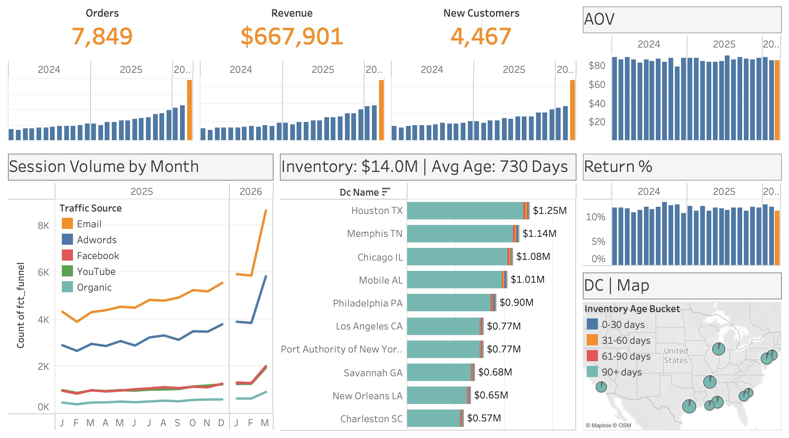

# TheLook eCommerce — Analytics Engineering Portfolio

An end-to-end analytics engineering project built on Google BigQuery's public
[TheLook eCommerce](https://console.cloud.google.com/marketplace/product/bigquery-public-data/thelook-ecommerce)
dataset. The project demonstrates a production-style dbt pipeline — staging,
intermediate, and mart layers with schema tests — alongside Python notebooks
for ad-hoc analysis and AI-generated executive reporting via the Claude API.

---

## Dashboard & Key Findings



### March 2026 Growth Spike (~50% MoM)
- Revenue and order volume both jumped ~50% in March 2026 — the largest single-month increase in the dataset
- The driver was a surge in session volume across the top three traffic sources (Email, Adwords, Facebook), not a change in conversion rate or AOV
- Growth was led by **new customer acquisition**, not repeat buyers — suggesting the spike reflects successful top-of-funnel campaign activity
- AOV held flat (~$80) and return rate remained stable (~10%), confirming this is genuine demand growth rather than a data artefact or pricing change

### Inventory Health Paradox
- Total inventory across distribution centers is **$14M** with an average item age of **730 days**
- However, all inventory units that are actively moving out of DCs are **under 60 days old** — a healthy turnover profile for the active SKU base
- The long-tail SKUs that aren't moving have been sitting for **several years**, creating significant dead-stock carrying cost
- This points to a classic **bi-modal inventory problem**: a fast-moving core buried inside a much larger pool of stagnant stock

### Distribution Center Consolidation Case
- Each DC holds roughly **$1M in inventory**, but the majority of that value is tied up in slow-moving or non-moving units
- The data supports a case for **right-sizing toward fewer, faster-turning facilities** focused on the active SKU base, rather than maintaining full inventory depth across all locations

---

## Tech Stack

| Layer | Tool |
|---|---|
| Cloud data warehouse | Google BigQuery |
| Transformation | dbt (Core) |
| Analysis & visualization | Python — pandas, matplotlib, seaborn |
| BQ client | google-cloud-bigquery |
| AI / LLM | Anthropic Claude API (claude-haiku-4-5) |
| Version control | Git / GitHub |

---

## Project Structure

```
portfolio_ecomm/
├── models/
│   ├── staging/          # Rename & type-cast raw source columns
│   ├── intermediate/     # Business logic, joins, aggregations
│   └── marts/            # Presentation-ready facts and dimensions
├── notebooks/
│   ├── eda_marts.ipynb              # Exploratory data analysis across all mart tables
│   ├── export_marts_to_excel.ipynb  # Export marts to Excel for stakeholder delivery
│   └── revenue_growth_analysis.ipynb # March 2026 growth deep-dive
├── dbt_project.yml
├── requirements.txt
└── config.py
```

---

## Data Model

The pipeline follows the **staging → intermediate → marts** pattern.
Staging and intermediate models are materialised as **views** to minimise
compute cost; mart models are materialised as **tables** for query performance.

### Sources

All data originates from the BigQuery public dataset
`bigquery-public-data.thelook_ecommerce`, which simulates a fictional online
clothing retailer with orders, users, products, events, and inventory.

### Staging Layer (`models/staging/`)

One model per source table. Each model renames columns to a consistent
convention and applies light type casting — no business logic.

| Model | Source Table | Purpose |
|---|---|---|
| `stg_thelook__orders` | orders | Order header with status and timestamps |
| `stg_thelook__order_items` | order_items | Line items with sale price and status |
| `stg_thelook__users` | users | User demographics and acquisition channel |
| `stg_thelook__products` | products | Product catalogue with cost and retail price |
| `stg_thelook__events` | events | Clickstream events with funnel stage and traffic source |
| `stg_thelook__inventory_items` | inventory_items | Per-unit inventory with cost and sold status |
| `stg_thelook__distribution_centers` | distribution_centers | DC name and coordinates |

### Intermediate Layer (`models/intermediate/`)

Joins and aggregations that encode business logic, consumed only by mart models
— never exposed directly to BI tools.

| Model | Grain | What it does |
|---|---|---|
| `int_orders_joined` | One row per order item | Joins order headers to line items; adds revenue and status alignment |
| `int_user_orders` | One row per user | LEFT JOINs users to lifetime order aggregations (count, returns, first/last order) |
| `int_product_inventory` | One row per product | Joins products to inventory summary for stock position |
| `int_funnel_events` | One row per event | Assigns funnel stage integers and a session-level `session_converted` flag via window function |

### Marts Layer (`models/marts/`)

Fact and dimension tables ready for BI consumption or notebook analysis.
All mart models are materialised as BigQuery tables.

**Fact tables**

| Model | Grain | Key metrics |
|---|---|---|
| `fct_orders` | One row per order | `order_revenue`, `delivery_days`, `is_returned` |
| `fct_order_items` | One row per order item | `sale_price`, `gross_profit`, `cost` |
| `fct_funnel` | One row per session | `purchased`, `converted`, stage flags, `traffic_source` |

**Dimension tables**

| Model | Grain | Derived segments |
|---|---|---|
| `dim_users` | One row per user | `customer_segment` (never\_purchased / one\_time / repeat / loyal), `return_segment` |
| `dim_products` | One row per product | `inventory_segment` (high\_velocity / mid\_velocity / low\_velocity / slow\_mover) |
| `dim_distribution_centers` | One row per DC | Name and lat/lon |

---

## Testing

Schema tests are defined in `schema.yml` files at each layer using dbt's
built-in test types:

- **`unique` / `not_null`** — primary key integrity on every model
- **`accepted_values`** — enumerated columns (order status, funnel stage,
  customer segment, inventory segment, conversion flag) are validated against
  known value sets
- **`relationships`** — referential integrity enforced between facts and
  dimensions (e.g. `fct_order_items.product_id` → `dim_products.product_id`)

Run all tests with:

```bash
dbt test
```

---

## Analysis Notebooks

### `revenue_growth_analysis.ipynb`

The main analytical output. Investigates a spike in March 2026 revenue across
ten analytical angles:

1. Monthly revenue trend
2. Order volume and average order value
3. Revenue by product category (heatmap + Mar vs prior delta)
4. Top brands — March 2026 vs prior 3-month average
5. New vs returning customer revenue mix
6. Revenue by traffic acquisition source
7. Geographic revenue distribution (top 10 countries)
8. Gross profit and margin trend
9. Session volume and funnel stage drop-off
10. Conversion rate trend and conversion by traffic source

Charts use a consistent colour scheme: **orange** for the highlight month,
**blue** for the three prior months, **gray** for older history.

### `eda_marts.ipynb`

Automated EDA across all mart tables — row counts, column distributions, null
rates, and sample data. Useful for onboarding and data quality review.

### `executive_summary.ipynb` ✦ AI Feature

Queries `fct_orders`, `fct_funnel`, and `dim_users` for the most recent
complete month's KPIs, compares them to the prior three-month average, and
calls the **Claude API** to generate a plain-English executive summary in
three paragraphs: top-line performance, growth drivers, and risks to watch.

The generated summary is saved to
[`assets/sample_output/executive_summary_latest.md`](assets/sample_output/executive_summary_latest.md).

**Sample output — March 2026:**

> March delivered exceptional top-line growth, with revenue reaching $204,278,
> up 89.8% against the prior three-month average, and orders climbing 88.2% to
> 2,354 units. This near-doubling of volume was achieved while holding average
> order value relatively flat at $86.78 … Gross margin remained stable at
> 51.2%, indicating we successfully scaled operations without material pressure
> on profitability.
>
> The surge in performance was fueled by a balanced contribution across new and
> repeat customer segments … Email emerged as the dominant channel by volume
> with 8,620 sessions and a robust 69.5% conversion rate …
>
> Two areas merit closer investigation. First, the zero return rate in March
> appears anomalous and should be validated … Second, organic traffic remains
> disproportionately small at less than 8% of total sessions …

### `export_marts_to_excel.ipynb`

Exports all mart tables to a single `.xlsx` file
(`outputs/ecomm_marts_export.xlsx`) with one sheet per mart, formatted for
stakeholder delivery.

---

## Setup

### Prerequisites

- Python 3.9+
- dbt-bigquery
- A Google Cloud project with BigQuery enabled
- A service account key with BigQuery Data Viewer and Job User roles

### Install Python dependencies

```bash
pip install -r requirements.txt
```

### Configure credentials

Copy `credentials/credentials_template.json` and populate it with your service
account key. Update `config.py` with your GCP project ID.

### Configure dbt

```bash
# ~/.dbt/profiles.yml
portfolio_ecomm:
  target: dev
  outputs:
    dev:
      type: bigquery
      method: service-account
      project: YOUR_GCP_PROJECT_ID
      dataset: ecomm_marts
      keyfile: /path/to/your/credentials.json
      threads: 4
      timeout_seconds: 300
```

### Build the pipeline

```bash
dbt run          # build all models
dbt test         # validate schema tests
dbt docs serve   # browse the lineage DAG
```

---

## Data Lineage (summary)

```
bigquery-public-data.thelook_ecommerce
         │
    [staging views]
    stg_thelook__*
         │
  [intermediate views]
  int_orders_joined ──────────────────────► fct_orders
  int_orders_joined ──────────────────────► fct_order_items
  int_user_orders   ──────────────────────► dim_users
  int_product_inventory ──────────────────► dim_products
  int_funnel_events ──────────────────────► fct_funnel
  stg_thelook__distribution_centers ──────► dim_distribution_centers
         │
     [mart tables]
     ecomm_marts.*
```

---

## Key Design Decisions

**Staging as views** — staging models contain no logic worth caching; keeping
them as views ensures the source schema is always reflected without a rebuild.

**Intermediate as views** — intermediate models are stepping stones, not
destinations. Making them views avoids storing redundant data while keeping
mart SQL readable.

**Marts as tables** — analysts and notebooks query mart models repeatedly and
at scale. Materialising as tables eliminates re-computation on every query.

**Session-level funnel conversion** — `int_funnel_events` uses a window
function (`MAX(...) OVER (PARTITION BY session_id)`) to flag every event in a
converting session, so `fct_funnel` can aggregate to the session grain without
a self-join.

**`traffic_source` on `fct_funnel`** — the TheLook events table records
`traffic_source` per event. Pulling it through `int_funnel_events` into
`fct_funnel` means conversion-by-channel analysis requires no join to
`dim_users`, correctly preserving anonymous (unauthenticated) sessions in the
denominator.

---

## Author

**Marc Alexander** — Senior, Leader, and Mentor in Business Intelligence and Analytics Engineering.
Specialising in cloud data platforms, dbt, and executive analytics.
